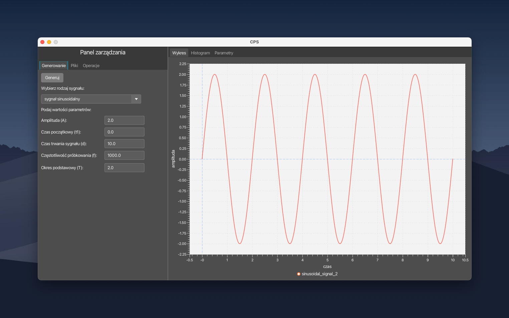
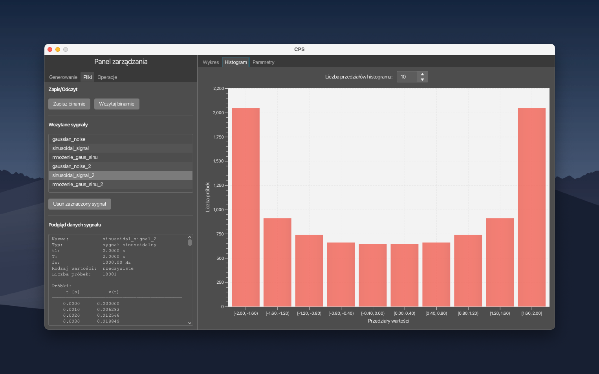
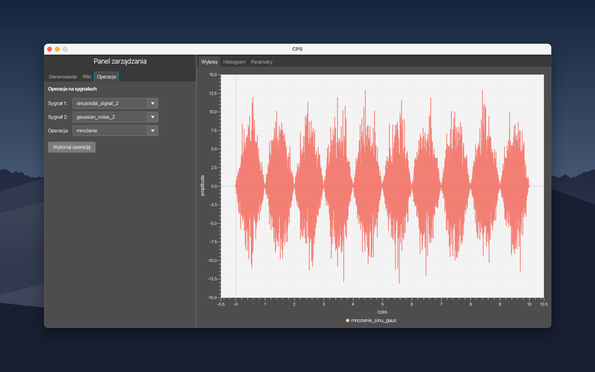
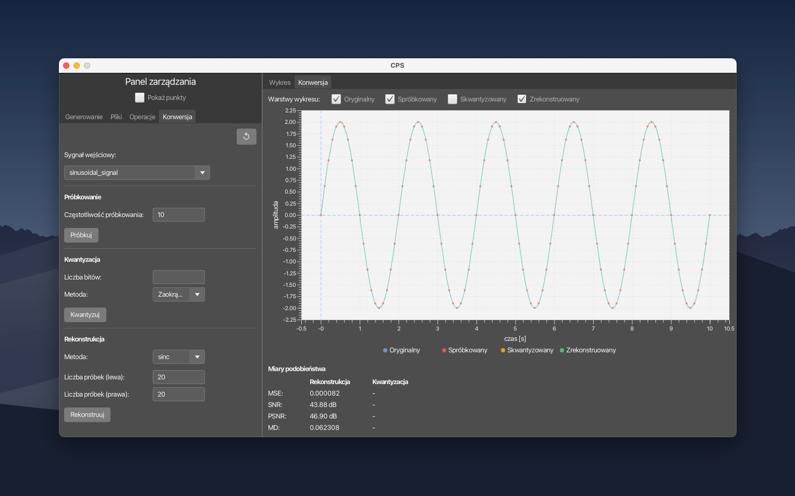

# Digital Signal Processing
_Cyfrowe przetwarzanie sygnału_

This repository contains assignments and implementations developed as part of the **Digital Signal Processing** course at Lodz University of Technology.

## Contents

| Task | Description |
|------|-------------|
| [Task 1 — Signal Generation](./task1-signal-generation) | Desktop application for generating, analyzing and operating on signals and noise |
| [Task 2 — Sampling and Quantization](./task1-signal-generation) | A/C and C/A conversion with sampling, quantization and reconstruction |

## Application

Both tasks are implemented as a single JavaFX desktop application located in `task1-signal-generation/`.

### Features

**Task 1 — Signal Generation**
- Generate 11 types of signals and noise (sinusoidal, rectangular, triangular, Gaussian noise, impulse noise and more)
- Configure signal parameters (amplitude, duration, sampling frequency, period, duty cycle etc.)
- Visualize signals as time-domain plots and histograms
- Compute signal statistics: mean, absolute mean, RMS, variance, average power
- Perform arithmetic operations on signals (add, subtract, multiply, divide)
- Save and load signals in a custom binary format (`.bin`)

**Task 2 — Sampling and Quantization**
- Uniform sampling with configurable sampling frequency
- Uniform quantization with rounding (configurable number of bits)
- Signal reconstruction: Zero-order hold (ZOH) and sinc interpolation
- Signal comparison metrics: MSE, SNR, PSNR, MD
- Aliasing demonstration

### Screenshots

**Signal generation — sinusoidal signal**




**Histogram**




**Signal operations**




**Signal conversion**



### Tech Stack
- **Java 23**
- **JavaFX** — UI and charts
- **Maven** — build tool

### Requirements
- Java 23+
- Maven 3.8+

### Run
```bash
cd task1-signal-generation
mvn javafx:run
```

## Technologies
- Language: `Java`
- Academic year: `2025/2026`
- Course: *Digital Signal Processing*
- University: *Lodz University of Technology*
